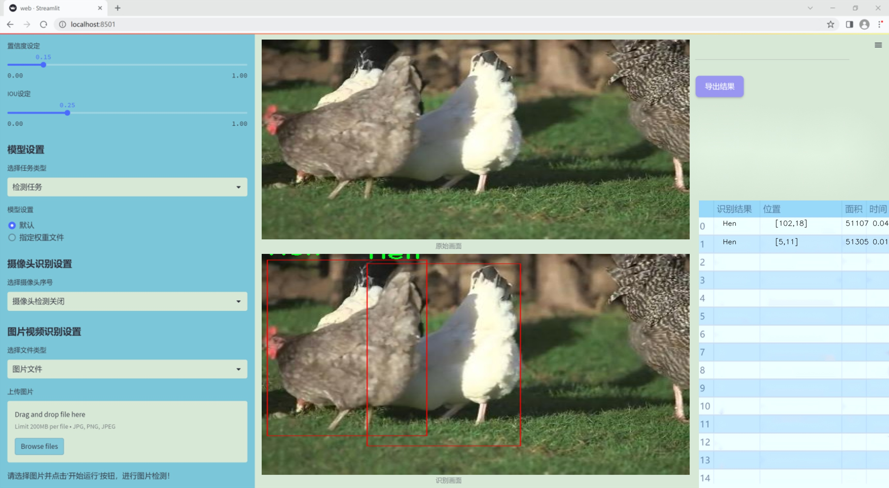
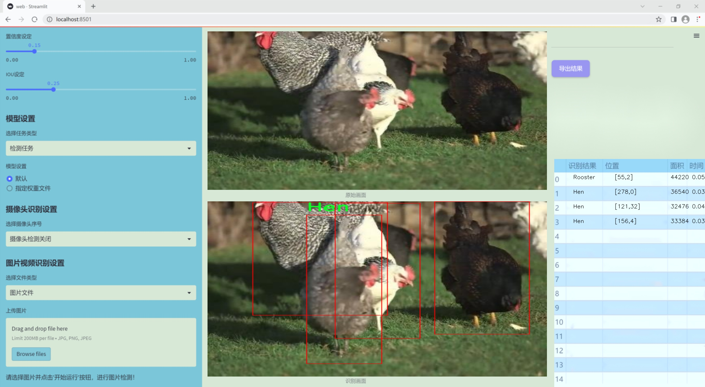
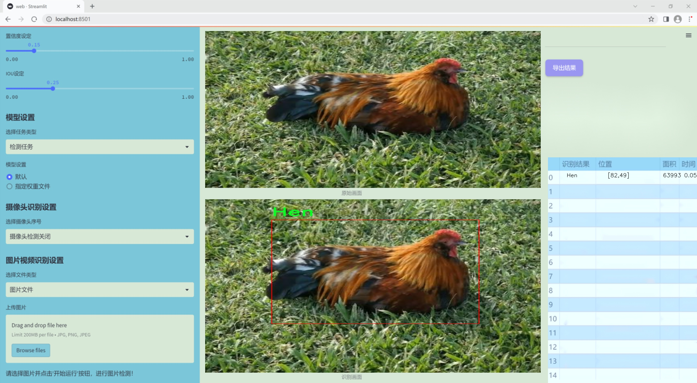
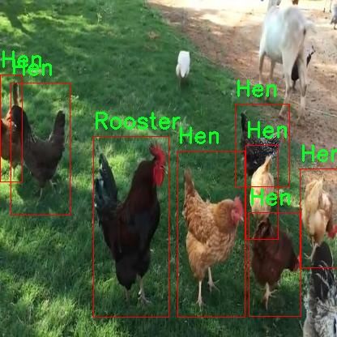
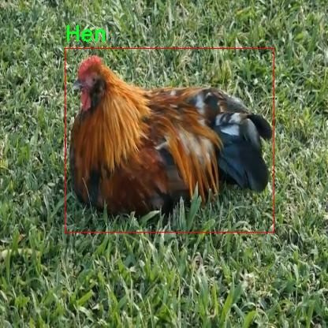
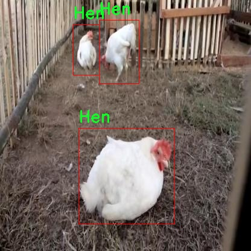
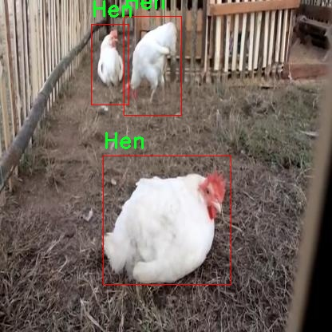
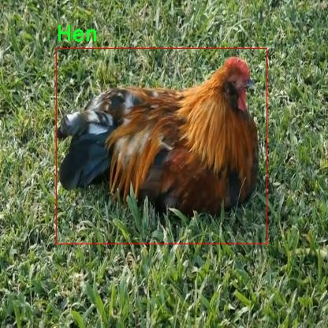

### 1.背景意义

研究背景与意义

随着农业现代化的不断推进，家禽养殖业在全球范围内扮演着越来越重要的角色。特别是在鸡的养殖中，准确识别不同年龄段和性别的鸡只，不仅能够提高养殖效率，还能为疾病防控、饲养管理和生产决策提供科学依据。传统的人工识别方法存在效率低、误差大等问题，亟需借助先进的计算机视觉技术来提升识别的准确性和效率。

近年来，深度学习技术的迅猛发展为图像识别领域带来了革命性的变化。其中，YOLO（You Only Look Once）系列模型因其高效的实时检测能力而广泛应用于各类目标检测任务。YOLOv11作为该系列的最新版本，具备更强的特征提取能力和更快的推理速度，适合在复杂的养殖环境中进行鸡只的实时监测与识别。

本研究旨在基于改进的YOLOv11模型，构建一个高效的成年鸡和小鸡识别系统。通过对包含219张图像的数据集进行训练，该系统能够准确识别出“Baby chicken”（小鸡）、“Hen”（母鸡）和“Rooster”（公鸡）三类目标。数据集经过精心标注和预处理，确保了模型训练的高效性和准确性。此外，采用数据增强技术进一步丰富了训练样本，提高了模型的泛化能力。

通过本项目的实施，不仅可以提升鸡只识别的自动化水平，还能为养殖业的智能化发展提供有力支持。未来，随着技术的不断进步，该系统有望在更大范围内推广应用，为家禽养殖行业带来更高的经济效益和管理效率。

### 2.视频效果

[2.1 视频效果](https://www.bilibili.com/video/BV1NMU5YyEuj/)

### 3.图片效果







##### [项目涉及的源码数据来源链接](https://kdocs.cn/l/cszuIiCKVNis)**

注意：本项目提供训练的数据集和训练教程,由于版本持续更新,暂不提供权重文件（best.pt）,请按照6.训练教程进行训练后实现上图演示的效果。

### 4.数据集信息

##### 4.1 本项目数据集类别数＆类别名

nc: 3
names: ['Baby chicken', 'Hen', 'Rooster']


该项目为【目标检测】数据集，请在【训练教程和Web端加载模型教程（第三步）】这一步的时候按照【目标检测】部分的教程来训练

##### 4.2 本项目数据集信息介绍

本项目数据集信息介绍

本项目旨在改进YOLOv11模型，以实现对成年鸡和小鸡的高效识别。为此，我们构建了一个专门的数据集，涵盖了三种主要类别：小鸡（Baby chicken）、母鸡（Hen）和公鸡（Rooster）。数据集的设计旨在确保模型能够在多样化的环境中准确识别和分类这些禽类，从而提升其在实际应用中的性能。

数据集的收集过程经过精心策划，涵盖了不同年龄段、性别和体态的鸡只，以确保模型在训练过程中能够学习到丰富的特征信息。小鸡的图像主要来源于幼鸟的日常活动场景，展示了它们在自然环境中的各种姿态和行为。母鸡的图像则涵盖了不同品种和颜色的母鸡，反映了它们在不同环境下的生活状态。公鸡的图像同样多样化，包含了不同的角度和光照条件，以增强模型的鲁棒性。

数据集的图像质量经过严格筛选，确保每个类别的样本都具有清晰的视觉信息，并且标注准确。这些图像不仅有助于提高YOLOv11模型的检测精度，还能够为后续的研究提供坚实的数据基础。此外，数据集还考虑到了实际应用中的挑战，如不同背景、光照变化和遮挡等因素，力求在多种复杂情况下都能保持良好的识别效果。

通过这一数据集的构建，我们希望能够推动鸡只识别技术的发展，为农业自动化、养殖管理等领域提供更为精准的解决方案。最终，改进后的YOLOv11模型将能够在实际应用中实现高效、准确的鸡只识别，为相关行业带来显著的经济效益和管理便利。











### 5.全套项目环境部署视频教程（零基础手把手教学）

[5.1 所需软件PyCharm和Anaconda安装教程（第一步）](https://www.bilibili.com/video/BV1BoC1YCEKi/?spm_id_from=333.999.0.0&vd_source=bc9aec86d164b67a7004b996143742dc)


[5.2 安装Python虚拟环境创建和依赖库安装视频教程（第二步）](https://www.bilibili.com/video/BV1ZoC1YCEBw?spm_id_from=333.788.videopod.sections&vd_source=bc9aec86d164b67a7004b996143742dc)

### 6.改进YOLOv11训练教程和Web_UI前端加载模型教程（零基础手把手教学）

[6.1 改进YOLOv11训练教程和Web_UI前端加载模型教程（第三步）](https://www.bilibili.com/video/BV1BoC1YCEhR?spm_id_from=333.788.videopod.sections&vd_source=bc9aec86d164b67a7004b996143742dc)


按照上面的训练视频教程链接加载项目提供的数据集，运行train.py即可开始训练



     Epoch   gpu_mem       box       obj       cls    labels  img_size
     1/200     20.8G   0.01576   0.01955  0.007536        22      1280: 100%|██████████| 849/849 [14:42<00:00,  1.04s/it]
               Class     Images     Labels          P          R     mAP@.5 mAP@.5:.95: 100%|██████████| 213/213 [01:14<00:00,  2.87it/s]
                 all       3395      17314      0.994      0.957      0.0957      0.0843

     Epoch   gpu_mem       box       obj       cls    labels  img_size
     2/200     20.8G   0.01578   0.01923  0.007006        22      1280: 100%|██████████| 849/849 [14:44<00:00,  1.04s/it]
               Class     Images     Labels          P          R     mAP@.5 mAP@.5:.95: 100%|██████████| 213/213 [01:12<00:00,  2.95it/s]
                 all       3395      17314      0.996      0.956      0.0957      0.0845

     Epoch   gpu_mem       box       obj       cls    labels  img_size
     3/200     20.8G   0.01561    0.0191  0.006895        27      1280: 100%|██████████| 849/849 [10:56<00:00,  1.29it/s]
               Class     Images     Labels          P          R     mAP@.5 mAP@.5:.95: 100%|███████   | 187/213 [00:52<00:00,  4.04it/s]
                 all       3395      17314      0.996      0.957      0.0957      0.0845


###### [项目数据集下载链接](https://kdocs.cn/l/cszuIiCKVNis)

### 7.原始YOLOv11算法讲解

YOLOv11是一种由Ultralytics公司开发的最新一代目标检测模型，以其增强的特征提取能力和更高的效率在计算机视觉领域引人注目。该模型在架构上进行了关键升级，通过更新主干和颈部结构，显著提高了对复杂视觉场景的理解和处理精度。YOLOv11不仅在目标检测上表现出色，还支持实例分割、图像分类、姿态估计和定向目标检测（OBB）等任务，展示出其多功能性。

与其前身YOLOv8相比，YOLOv11在设计上实现了深度和宽度的改变，同时引入了几个创新机制。其中，C3k2机制是对YOLOv8中的C2f的改进，提升了浅层特征的处理能力；C2PSA机制则进一步优化了特征图的处理流程。解耦头的创新设计，通过增加两个深度卷积（DWConv），提高了模型对细节的感知能力和分类准确性。

在性能上，YOLOv11m模型在COCO数据集上的平均精度（mAP）提高，并减少了22%的参数量，确保了在运算效率上的突破。该模型可以部署在多种平台上，包括边缘设备、云平台以及支持NVIDIA GPU的系统，彰显出卓越的灵活性和适应性。总体而言，YOLOv11通过一系列的创新突破，对目标检测领域产生了深远的影响，并为未来的开发提供了新的研究方向。


****文档**** ： _ _https://docs.ultralytics.com/models/yolo11/__

****代码链接**** ： _ _https://github.com/ultralytics/ultralytics__

******Performance Metrics******


​ ** **关键特性****

****◆**** ** **增强的特征提取能力**** ：YOLO11采用了改进的主干和颈部架构，增强了 ** **特征提取****
能力，能够实现更精确的目标检测和复杂任务的执行。

****◆**** ** **优化的效率和速度****
：YOLO11引入了精细化的架构设计和优化的训练流程，提供更快的处理速度，并在准确性和性能之间保持最佳平衡。

****◆**** ** **参数更少、精度更高****
：通过模型设计的改进，YOLO11m在COCO数据集上实现了更高的平均精度（mAP），同时使用的参数比YOLOv8m少22%，使其在计算上更加高效，而不牺牲准确性。

****◆**** ** **跨环境的适应性**** ：YOLO11可以无缝部署在各种环境中，包括边缘设备、云平台和支持NVIDIA
GPU的系统，确保最大的灵活性。

****◆**** ** **支持广泛任务****
：无论是目标检测、实例分割、图像分类、姿态估计还是定向目标检测（OBB），YOLO11都旨在应对一系列计算机视觉挑战。

****支持的任务和模式****


​YOLO11建立在YOLOv8中引入的多功能模型范围之上，为各种计算机视觉任务提供增强的支持:


​该表提供了YOLO11模型变体的概述，展示了它们在特定任务中的适用性以及与Inference、Validation、Training和Export等操作模式的兼容性。从实时检测到复杂的分割任务
，这种灵活性使YOLO11适用于计算机视觉的广泛应用。

##### yolov11的创新

■ yolov8 VS yolov11

YOLOv5，YOLOv8和YOLOv11均是ultralytics公司的作品，ultralytics出品必属精品。


​ **具体创新点** ：

**① 深度（depth）和宽度 （width）**

YOLOv8和YOLOv11是基本上完全不同。

**② C3k2机制**

C3k2有参数为c3k，其中在网络的浅层c3k设置为False。C3k2就相当于YOLOv8中的C2f。


​ **③ C2PSA机制**

下图为C2PSA机制的原理图。


​ **④ 解耦头**

解耦头中的分类检测头增加了两个 **DWConv** 。


▲Conv

    
    
    def autopad(k, p=None, d=1):  # kernel, padding, dilation
    
        """Pad to 'same' shape outputs."""
    
        if d > 1:
    
            k = d * (k - 1) + 1 if isinstance(k, int) else [d * (x - 1) + 1 for x in k]  # actual kernel-size
    
        if p is None:
    
            p = k // 2 if isinstance(k, int) else [x // 2 for x in k]  # auto-pad
    
    return p
    
    
    class Conv(nn.Module):
    
        """Standard convolution with args(ch_in, ch_out, kernel, stride, padding, groups, dilation, activation)."""
    
    
        default_act = nn.SiLU()  # default activation
    
    
        def __init__(self, c1, c2, k=1, s=1, p=None, g=1, d=1, act=True):
    
            """Initialize Conv layer with given arguments including activation."""
    
            super().__init__()
    
            self.conv = nn.Conv2d(c1, c2, k, s, autopad(k, p, d), groups=g, dilation=d, bias=False)
    
            self.bn = nn.BatchNorm2d(c2)
    
            self.act = self.default_act if act is True else act if isinstance(act, nn.Module) else nn.Identity()
    
    
        def forward(self, x):
    
            """Apply convolution, batch normalization and activation to input tensor."""
    
            return self.act(self.bn(self.conv(x)))
    
    
        def forward_fuse(self, x):
    
            """Perform transposed convolution of 2D data."""
    
            return self.act(self.conv(x))

▲Conv2d

    
    
    torch.nn.Conv2d(in_channels, out_channels, kernel_size, stride=1, padding=0, dilation=1, groups=1, bias=True, padding_mode='zeros')

▲DWConv

DWConv ** **代表 Depthwise Convolution（深度卷积）****
，是一种在卷积神经网络中常用的高效卷积操作。它主要用于减少计算复杂度和参数量。

    
    
    class DWConv(Conv):
    
        """Depth-wise convolution."""
    
    
        def __init__(self, c1, c2, k=1, s=1, d=1, act=True):  # ch_in, ch_out, kernel, stride, dilation, activation
    
            """Initialize Depth-wise convolution with given parameters."""
    
            super().__init__(c1, c2, k, s, g=math.gcd(c1, c2), d=d, act=act)


### 8.200+种全套改进YOLOV11创新点原理讲解

#### 8.1 200+种全套改进YOLOV11创新点原理讲解大全

由于篇幅限制，每个创新点的具体原理讲解就不全部展开，具体见下列网址中的改进模块对应项目的技术原理博客网址【Blog】（创新点均为模块化搭建，原理适配YOLOv5~YOLOv11等各种版本）

[改进模块技术原理博客【Blog】网址链接](https://gitee.com/qunmasj/good)


#### 8.2 精选部分改进YOLOV11创新点原理讲解

###### 这里节选部分改进创新点展开原理讲解(完整的改进原理见上图和[改进模块技术原理博客链接](https://gitee.com/qunmasj/good)【如果此小节的图加载失败可以通过CSDN或者Github搜索该博客的标题访问原始博客，原始博客图片显示正常】

### MS-Block简介
实时目标检测，以YOLO系列为例，已在工业领域中找到重要应用，特别是在边缘设备（如无人机和机器人）中。与之前的目标检测器不同，实时目标检测器旨在在速度和准确性之间追求最佳平衡。为了实现这一目标，提出了大量的工作：从第一代DarkNet到CSPNet，再到最近的扩展ELAN，随着性能的快速增长，实时目标检测器的架构经历了巨大的变化。

尽管性能令人印象深刻，但在不同尺度上识别对象仍然是实时目标检测器面临的基本挑战。这促使作者设计了一个强大的编码器架构，用于学习具有表现力的多尺度特征表示。具体而言，作者从两个新的角度考虑为实时目标检测编码多尺度特征：

从局部视角出发，作者设计了一个具有简单而有效的分层特征融合策略的MS-Block。受到Res2Net的启发，作者在MS-Block中引入了多个分支来进行特征提取，但不同的是，作者使用了一个带有深度卷积的 Inverted Bottleneck Block块，以实现对大Kernel的高效利用。

从全局视角出发，作者提出随着网络加深逐渐增加卷积的Kernel-Size。作者在浅层使用小Kernel卷积来更高效地处理高分辨率特征。另一方面，在深层中，作者采用大Kernel卷积来捕捉广泛的信息。

基于以上设计原则，作者呈现了作者的实时目标检测器，称为YOLO-MS。为了评估作者的YOLO-MS的性能，作者在MS COCO数据集上进行了全面的实验。还提供了与其他最先进方法的定量比较，以展示作者方法的强大性能。如图1所示，YOLO-MS在计算性能平衡方面优于其他近期的实时目标检测器。


具体而言，YOLO-MS-XS在MS COCO上获得了43%+的AP得分，仅具有450万个可学习参数和8.7亿个FLOPs。YOLO-MS-S和YOLO-MS分别获得了46%+和51%+的AP，可学习参数分别为810万和2220万。此外，作者的工作还可以作为其他YOLO模型的即插即用模块。通常情况下，作者的方法可以将YOLOv11的AP从37%+显著提高到40%+，甚至还可以使用更少的参数和FLOPs。

CSP Block是一个基于阶段级梯度路径的网络，平衡了梯度组合和计算成本。它是广泛应用于YOLO系列的基本构建块。已经提出了几种变体，包括YOLOv4和YOLOv11中的原始版本，Scaled YOLOv4中的CSPVoVNet，YOLOv11中的ELAN，以及RTMDet中提出的大Kernel单元。作者在图2(a)和图2(b)中分别展示了原始CSP块和ELAN的结构。


上述实时检测器中被忽视的一个关键方面是如何在基本构建块中编码多尺度特征。其中一个强大的设计原则是Res2Net，它聚合了来自不同层次的特征以增强多尺度表示。然而，这一原则并没有充分探索大Kernel卷积的作用，而大Kernel卷积已经在基于CNN的视觉识别任务模型中证明有效。将大Kernel卷积纳入Res2Net的主要障碍在于它们引入的计算开销，因为构建块采用了标准卷积。在作者的方法中，作者提出用 Inverted Bottleneck Block替代标准的3 × 3卷积，以享受大Kernel卷积的好处。

#### MS-Block

基于前面的分析，参考该博客提出了一个带有分层特征融合策略的全新Block，称为MS-Block，以增强实时目标检测器在提取多尺度特征时的能力，同时保持快速的推理速度。

MS-Block的具体结构如图2(c)所示。假设是输入特征。通过1×1卷积的转换后，X的通道维度增加到n*C。然后，作者将X分割成n个不同的组，表示为，其中。为了降低计算成本，作者选择n为3。

注意，除了之外，每个其他组都经过一个 Inverted Bottleneck Block层，用表示，其中k表示Kernel-Size，以获得。的数学表示如下：


根据这个公式，作者不将 Inverted Bottleneck Block层连接到，使其作为跨阶段连接，并保留来自前面层的信息。最后，作者将所有分割连接在一起，并应用1×1卷积来在所有分割之间进行交互，每个分割都编码不同尺度的特征。当网络加深时，这个1×1卷积也用于调整通道数。

#### Heterogeneous Kernel Selection Protocol
除了构建块的设计外，作者还从宏观角度探讨了卷积的使用。之前的实时目标检测器在不同的编码器阶段采用了同质卷积（即具有相同Kernel-Size的卷积），但作者认为这不是提取多尺度语义信息的最佳选项。

在金字塔结构中，从检测器的浅阶段提取的高分辨率特征通常用于捕捉细粒度语义，将用于检测小目标。相反，来自网络较深阶段的低分辨率特征用于捕捉高级语义，将用于检测大目标。如果作者在所有阶段都采用统一的小Kernel卷积，深阶段的有效感受野（ERF）将受到限制，影响大目标的性能。在每个阶段中引入大Kernel卷积可以帮助解决这个问题。然而，具有大的ERF的大Kernel可以编码更广泛的区域，这增加了在小目标外部包含噪声信息的概率，并且降低了推理速度。

在这项工作中，作者建议在不同阶段中采用异构卷积，以帮助捕获更丰富的多尺度特征。具体来说，在编码器的第一个阶段中，作者采用最小Kernel卷积，而最大Kernel卷积位于最后一个阶段。随后，作者逐步增加中间阶段的Kernel-Size，使其与特征分辨率的增加保持一致。这种策略允许提取细粒度和粗粒度的语义信息，增强了编码器的多尺度特征表示能力。

正如图所示，作者将k的值分别分配给编码器中的浅阶段到深阶段，取值为3、5、7和9。作者将其称为异构Kernel选择（HKS）协议。


作者的HKS协议能够在深层中扩大感受野，而不会对浅层产生任何其他影响。第4节的图4支持了作者的分析。此外，HKS不仅有助于编码更丰富的多尺度特征，还确保了高效的推理。

如表1所示，将大Kernel卷积应用于高分辨率特征会产生较高的计算开销。然而，作者的HKS协议在低分辨率特征上采用大Kernel卷积，从而与仅使用大Kernel卷积相比，大大降低了计算成本。


在实践中，作者经验性地发现，采用HKS协议的YOLO-MS的推理速度几乎与仅使用深度可分离的3 × 3卷积相同。


如图所示，作者模型的Backbone由4个阶段组成，每个阶段后面跟随1个步长为2的3 × 3卷积进行下采样。在第3个阶段后，作者添加了1个SPP块，与RTMDet中一样。在作者的编码器上，作者使用PAFPN作为Neck来构建特征金字塔[31, 35]。它融合了从Backbone不同阶段提取的多尺度特征。Neck中使用的基本构建块也是作者的MS-Block，在其中使用3 × 3深度可分离卷积进行快速推理。

此外，为了在速度和准确性之间取得更好的平衡，作者将Backbone中多级特征的通道深度减半。作者提供了3个不同尺度的YOLO-MS变体，即YOLO-MS-XS、YOLO-MS-S和YOLO-MS。不同尺度的YOLO-MS的详细配置列在表2中。对于YOLO-MS的其他部分，作者将其保持与RTMDet相同。


### 9.系统功能展示

图9.1.系统支持检测结果表格显示

  图9.2.系统支持置信度和IOU阈值手动调节

  图9.3.系统支持自定义加载权重文件best.pt(需要你通过步骤5中训练获得)

  图9.4.系统支持摄像头实时识别

  图9.5.系统支持图片识别

  图9.6.系统支持视频识别

  图9.7.系统支持识别结果文件自动保存

  图9.8.系统支持Excel导出检测结果数据


### 10. YOLOv11核心改进源码讲解

#### 10.1 FreqFusion.py

以下是对给定代码的核心部分进行分析和注释，保留了最重要的功能，并提供了详细的中文注释。

```python
import torch
import torch.nn as nn
import torch.nn.functional as F

class FreqFusion(nn.Module):
    def __init__(self, channels, scale_factor=1, lowpass_kernel=5, highpass_kernel=3, **kwargs):
        """
        初始化频率融合模块。

        参数：
        - channels: 输入特征的通道数，格式为 (高分辨率通道数, 低分辨率通道数)
        - scale_factor: 上采样因子
        - lowpass_kernel: 低通滤波器的卷积核大小
        - highpass_kernel: 高通滤波器的卷积核大小
        """
        super().__init__()
        hr_channels, lr_channels = channels
        self.scale_factor = scale_factor
        self.lowpass_kernel = lowpass_kernel
        self.highpass_kernel = highpass_kernel
        
        # 压缩高分辨率和低分辨率特征通道
        self.hr_channel_compressor = nn.Conv2d(hr_channels, hr_channels // 8, kernel_size=1)
        self.lr_channel_compressor = nn.Conv2d(lr_channels, lr_channels // 8, kernel_size=1)

        # 低通和高通特征编码器
        self.content_encoder = nn.Conv2d(hr_channels // 8, lowpass_kernel ** 2, kernel_size=3, padding=1)
        self.content_encoder2 = nn.Conv2d(hr_channels // 8, highpass_kernel ** 2, kernel_size=3, padding=1)

    def kernel_normalizer(self, mask, kernel):
        """
        对卷积核进行归一化处理。

        参数：
        - mask: 输入的卷积核
        - kernel: 卷积核的大小
        """
        mask = F.softmax(mask.view(mask.size(0), -1), dim=1)  # 归一化
        mask = mask.view(mask.size(0), 1, kernel, kernel)  # 重新调整形状
        return mask

    def forward(self, x):
        """
        前向传播函数。

        参数：
        - x: 输入特征，格式为 (高分辨率特征, 低分辨率特征)

        返回：
        - 融合后的特征
        """
        hr_feat, lr_feat = x
        
        # 压缩特征
        compressed_hr_feat = self.hr_channel_compressor(hr_feat)
        compressed_lr_feat = self.lr_channel_compressor(lr_feat)

        # 计算低通和高通特征
        mask_lr = self.content_encoder(compressed_lr_feat)
        mask_hr = self.content_encoder2(compressed_hr_feat)

        # 归一化卷积核
        mask_lr = self.kernel_normalizer(mask_lr, self.lowpass_kernel)
        mask_hr = self.kernel_normalizer(mask_hr, self.highpass_kernel)

        # 使用低通和高通特征进行融合
        lr_feat = F.conv2d(lr_feat, mask_lr)  # 低通处理
        hr_feat = F.conv2d(hr_feat, mask_hr)  # 高通处理

        return hr_feat + lr_feat  # 返回融合后的特征

# 该模块的核心功能是通过低通和高通滤波器对输入特征进行处理，融合高分辨率和低分辨率特征。
```

### 代码分析：
1. **FreqFusion类**：这是一个继承自`nn.Module`的类，主要用于实现频率感知特征融合。它的构造函数初始化了高分辨率和低分辨率特征的通道压缩器，以及低通和高通特征编码器。

2. **kernel_normalizer方法**：该方法用于对卷积核进行归一化处理，以确保在后续的卷积操作中能够有效地利用卷积核。

3. **forward方法**：这是前向传播的核心部分，接收高分辨率和低分辨率特征，经过压缩和滤波处理后返回融合后的特征。

### 总结：
该代码实现了一个频率感知特征融合模块，能够有效地将高分辨率和低分辨率特征进行融合，以提升图像预测的精度。通过低通和高通滤波器的使用，能够更好地捕捉图像中的细节和结构信息。

该文件 `FreqFusion.py` 实现了一个名为 `FreqFusion` 的深度学习模块，主要用于图像预测任务，特别是在密集图像预测中。这个模块通过频率感知的特征融合方法来提高图像的质量和准确性。以下是对该文件的逐步分析和说明。

首先，文件导入了必要的库，包括 PyTorch 和一些用于图像处理的函数。接着定义了一些初始化函数，如 `normal_init` 和 `constant_init`，用于对模型的权重和偏置进行初始化。这些初始化方法确保了模型在训练开始时具有良好的起始状态。

接下来，定义了一个 `resize` 函数，用于调整输入张量的大小，使用插值方法来处理图像的缩放问题。这个函数还包含了一些警告机制，以确保在特定条件下使用合适的插值方式。

`hamming2D` 函数用于生成二维 Hamming 窗口，这在信号处理和图像处理中常用于减少边缘效应。该函数通过生成一维 Hamming 窗口并计算外积来创建二维窗口。

`FreqFusion` 类是该文件的核心部分，继承自 `nn.Module`。在初始化方法中，定义了多个参数和层，包括高频和低频通道的压缩、内容编码器、以及可选的特征重采样模块。该类的设计允许用户通过参数灵活调整模型的行为，比如选择是否使用高通或低通滤波器，是否使用 Hamming 窗口等。

在 `init_weights` 方法中，模型的权重被初始化为均匀分布或正态分布，以确保模型在训练开始时的稳定性。

`kernel_normalizer` 方法用于对生成的掩码进行归一化处理，以确保其和为1，这在后续的卷积操作中非常重要。

`forward` 方法是模型的前向传播函数，接受高分辨率和低分辨率的特征图作为输入，并通过一系列的卷积和插值操作融合这些特征。该方法支持使用检查点机制以节省内存。

`_forward` 方法实现了实际的特征融合逻辑，包括对高频和低频特征的处理。它根据不同的配置选择使用高通或低通滤波器，并通过 `carafe` 函数进行特征重采样。最终，融合后的特征图被返回。

此外，文件中还定义了一个 `LocalSimGuidedSampler` 类，用于生成偏移量，以便在特征重采样时使用。该类使用了局部相似性来指导重采样过程，确保生成的图像在视觉上更为连贯。

最后，`compute_similarity` 函数用于计算输入张量中每个点与其周围点的余弦相似度，这在特征重采样中起到关键作用。

总体而言，`FreqFusion.py` 文件实现了一个复杂的深度学习模块，通过频率感知的特征融合方法来提高图像预测的质量，适用于各种计算机视觉任务。该模块的设计灵活且可扩展，能够根据不同的需求进行调整。

#### 10.2 afpn.py

以下是经过简化和注释的核心代码部分：

```python
import torch
import torch.nn as nn
import torch.nn.functional as F
from ..modules.conv import Conv

# 定义基本的卷积块
class BasicBlock(nn.Module):
    def __init__(self, filter_in, filter_out):
        super(BasicBlock, self).__init__()
        # 定义两个卷积层
        self.conv1 = Conv(filter_in, filter_out, 3)
        self.conv2 = Conv(filter_out, filter_out, 3, act=False)

    def forward(self, x):
        residual = x  # 保存输入以便后续残差连接
        out = self.conv1(x)  # 第一个卷积层
        out = self.conv2(out)  # 第二个卷积层
        out += residual  # 残差连接
        return self.conv1.act(out)  # 返回激活后的输出

# 定义上采样模块
class Upsample(nn.Module):
    def __init__(self, in_channels, out_channels, scale_factor=2):
        super(Upsample, self).__init__()
        # 定义上采样过程
        self.upsample = nn.Sequential(
            Conv(in_channels, out_channels, 1),  # 1x1卷积
            nn.Upsample(scale_factor=scale_factor, mode='bilinear')  # 双线性插值上采样
        )

    def forward(self, x):
        return self.upsample(x)  # 执行上采样

# 定义下采样模块
class Downsample_x2(nn.Module):
    def __init__(self, in_channels, out_channels):
        super(Downsample_x2, self).__init__()
        # 定义2倍下采样
        self.downsample = Conv(in_channels, out_channels, 2, 2, 0)

    def forward(self, x):
        return self.downsample(x)  # 执行下采样

# 定义自适应特征融合模块（ASFF）
class ASFF_2(nn.Module):
    def __init__(self, inter_dim=512):
        super(ASFF_2, self).__init__()
        self.inter_dim = inter_dim
        compress_c = 8  # 压缩通道数

        # 定义权重计算卷积
        self.weight_level_1 = Conv(self.inter_dim, compress_c, 1)
        self.weight_level_2 = Conv(self.inter_dim, compress_c, 1)
        self.weight_levels = nn.Conv2d(compress_c * 2, 2, kernel_size=1)  # 合并权重
        self.conv = Conv(self.inter_dim, self.inter_dim, 3)  # 最后的卷积层

    def forward(self, input1, input2):
        # 计算输入的权重
        level_1_weight_v = self.weight_level_1(input1)
        level_2_weight_v = self.weight_level_2(input2)

        # 合并权重并进行softmax归一化
        levels_weight_v = torch.cat((level_1_weight_v, level_2_weight_v), 1)
        levels_weight = self.weight_levels(levels_weight_v)
        levels_weight = F.softmax(levels_weight, dim=1)

        # 融合输入特征
        fused_out_reduced = input1 * levels_weight[:, 0:1, :, :] + input2 * levels_weight[:, 1:2, :, :]
        out = self.conv(fused_out_reduced)  # 最后的卷积
        return out

# 定义主网络结构
class AFPN_P345(nn.Module):
    def __init__(self, in_channels=[256, 512, 1024], out_channels=256, factor=4):
        super(AFPN_P345, self).__init__()
        # 定义输入通道的卷积层
        self.conv0 = Conv(in_channels[0], in_channels[0] // factor, 1)
        self.conv1 = Conv(in_channels[1], in_channels[1] // factor, 1)
        self.conv2 = Conv(in_channels[2], in_channels[2] // factor, 1)

        # 定义主网络体
        self.body = BlockBody_P345([in_channels[0] // factor, in_channels[1] // factor, in_channels[2] // factor])

        # 定义输出通道的卷积层
        self.conv00 = Conv(in_channels[0] // factor, out_channels, 1)
        self.conv11 = Conv(in_channels[1] // factor, out_channels, 1)
        self.conv22 = Conv(in_channels[2] // factor, out_channels, 1)

    def forward(self, x):
        x0, x1, x2 = x  # 输入的三个特征图
        x0 = self.conv0(x0)  # 对每个特征图进行卷积处理
        x1 = self.conv1(x1)
        x2 = self.conv2(x2)

        out0, out1, out2 = self.body([x0, x1, x2])  # 通过主网络体处理特征图

        out0 = self.conv00(out0)  # 输出处理
        out1 = self.conv11(out1)
        out2 = self.conv22(out2)
        return [out0, out1, out2]  # 返回处理后的特征图
```

### 代码说明：
1. **BasicBlock**: 这是一个基本的卷积块，包含两个卷积层和一个残差连接。
2. **Upsample**: 这个模块用于上采样，首先通过1x1卷积调整通道数，然后进行双线性插值上采样。
3. **Downsample_x2**: 这个模块用于将输入特征图的尺寸减半。
4. **ASFF_2**: 自适应特征融合模块，通过计算输入特征的权重并进行融合，输出融合后的特征图。
5. **AFPN_P345**: 主网络结构，负责处理输入特征图并通过卷积和自适应特征融合模块生成输出特征图。

这个程序文件 `afpn.py` 实现了一种名为自适应特征金字塔网络（AFPN）的深度学习模型，主要用于图像处理任务，如目标检测和分割。该模型通过不同尺度的特征融合来增强特征表达能力。

文件中首先导入了一些必要的库，包括 `torch` 和 `torch.nn`，以及一些自定义的模块（如 `Conv` 和各种块结构）。接着定义了一系列类，这些类构成了AFPN的基础结构。

`BasicBlock` 类实现了一个基本的卷积块，包含两个卷积层和残差连接。`Upsample` 和 `Downsample_x2/x4/x8` 类则分别实现了上采样和不同倍数的下采样操作，使用卷积层和插值方法调整特征图的尺寸。

`ASFF_2/3/4` 类实现了自适应特征融合模块，能够根据输入特征图的权重动态融合不同尺度的特征。这些模块通过计算输入特征图的权重，并利用softmax函数归一化权重，最终输出融合后的特征图。

`BlockBody_P345` 和 `BlockBody_P2345` 类实现了特定结构的特征提取模块，分别处理三个和四个尺度的特征。它们通过堆叠多个卷积块和自适应特征融合模块，逐步提取和融合特征。

`AFPN_P345` 和 `AFPN_P2345` 类则是整个网络的主干结构，负责接收输入特征图，经过一系列卷积和特征融合操作后输出处理后的特征图。这些类还包括了权重初始化的代码，以确保网络在训练时的稳定性。

最后，`AFPN_P345_Custom` 和 `AFPN_P2345_Custom` 类允许用户自定义块类型，以便在特定任务中进行灵活调整。

整体来看，这个文件定义了一个灵活且强大的特征提取网络，能够处理多尺度特征，并通过自适应融合来提高模型的性能。

#### 10.3 fadc.py

以下是代码中最核心的部分，并附上详细的中文注释：

```python
import torch
import torch.nn as nn
import torch.nn.functional as F

class OmniAttention(nn.Module):
    def __init__(self, in_planes, out_planes, kernel_size, groups=1, reduction=0.0625, kernel_num=4, min_channel=16):
        super(OmniAttention, self).__init__()
        # 计算注意力通道数
        attention_channel = max(int(in_planes * reduction), min_channel)
        self.kernel_size = kernel_size
        self.kernel_num = kernel_num
        self.temperature = 1.0  # 温度参数，用于控制注意力的平滑程度

        # 定义平均池化层
        self.avgpool = nn.AdaptiveAvgPool2d(1)
        # 定义全连接层
        self.fc = nn.Conv2d(in_planes, attention_channel, 1, bias=False)
        self.bn = nn.BatchNorm2d(attention_channel)  # 批归一化
        self.relu = nn.ReLU(inplace=True)  # ReLU激活函数

        # 定义通道注意力的全连接层
        self.channel_fc = nn.Conv2d(attention_channel, in_planes, 1, bias=True)

        # 根据输入和输出通道的关系选择过滤器注意力的计算方式
        if in_planes == groups and in_planes == out_planes:  # 深度卷积
            self.func_filter = self.skip
        else:
            self.filter_fc = nn.Conv2d(attention_channel, out_planes, 1, bias=True)
            self.func_filter = self.get_filter_attention

        # 根据卷积核大小选择空间注意力的计算方式
        if kernel_size == 1:  # 点卷积
            self.func_spatial = self.skip
        else:
            self.spatial_fc = nn.Conv2d(attention_channel, kernel_size * kernel_size, 1, bias=True)
            self.func_spatial = self.get_spatial_attention

        # 根据卷积核数量选择核注意力的计算方式
        if kernel_num == 1:
            self.func_kernel = self.skip
        else:
            self.kernel_fc = nn.Conv2d(attention_channel, kernel_num, 1, bias=True)
            self.func_kernel = self.get_kernel_attention

        self._initialize_weights()  # 初始化权重

    def _initialize_weights(self):
        # 初始化卷积层和批归一化层的权重
        for m in self.modules():
            if isinstance(m, nn.Conv2d):
                nn.init.kaiming_normal_(m.weight, mode='fan_out', nonlinearity='relu')
                if m.bias is not None:
                    nn.init.constant_(m.bias, 0)
            if isinstance(m, nn.BatchNorm2d):
                nn.init.constant_(m.weight, 1)
                nn.init.constant_(m.bias, 0)

    def skip(self, _):
        return 1.0  # 跳过操作，返回1.0

    def get_channel_attention(self, x):
        # 计算通道注意力
        channel_attention = torch.sigmoid(self.channel_fc(x).view(x.size(0), -1, 1, 1) / self.temperature)
        return channel_attention

    def get_filter_attention(self, x):
        # 计算过滤器注意力
        filter_attention = torch.sigmoid(self.filter_fc(x).view(x.size(0), -1, 1, 1) / self.temperature)
        return filter_attention

    def get_spatial_attention(self, x):
        # 计算空间注意力
        spatial_attention = self.spatial_fc(x).view(x.size(0), 1, 1, 1, self.kernel_size, self.kernel_size)
        spatial_attention = torch.sigmoid(spatial_attention / self.temperature)
        return spatial_attention

    def get_kernel_attention(self, x):
        # 计算核注意力
        kernel_attention = self.kernel_fc(x).view(x.size(0), -1, 1, 1, 1, 1)
        kernel_attention = F.softmax(kernel_attention / self.temperature, dim=1)
        return kernel_attention

    def forward(self, x):
        # 前向传播
        x = self.avgpool(x)  # 平均池化
        x = self.fc(x)  # 全连接层
        x = self.bn(x)  # 批归一化
        x = self.relu(x)  # ReLU激活
        # 返回通道、过滤器、空间和核的注意力
        return self.func_channel(x), self.func_filter(x), self.func_spatial(x), self.func_kernel(x)

class AdaptiveDilatedConv(nn.Module):
    """自适应膨胀卷积的封装，作为普通卷积层使用。"""
    
    def __init__(self, in_channels, out_channels, kernel_size, stride=1, padding=0, dilation=1, groups=1, bias=True):
        super(AdaptiveDilatedConv, self).__init__()
        # 初始化卷积层参数
        self.conv = nn.Conv2d(in_channels, out_channels, kernel_size, stride=stride, padding=padding, dilation=dilation, groups=groups, bias=bias)
        self.omni_attention = OmniAttention(in_channels, out_channels, kernel_size)  # 初始化OmniAttention

    def forward(self, x):
        # 前向传播
        attention_outputs = self.omni_attention(x)  # 计算注意力
        x = self.conv(x)  # 卷积操作
        # 根据注意力调整输出
        return x * attention_outputs[0]  # 使用通道注意力调整输出
```

### 代码说明：
1. **OmniAttention 类**：实现了一个多种注意力机制的模块，包括通道注意力、过滤器注意力、空间注意力和核注意力。它通过自适应地调整特征图的不同部分来增强模型的表达能力。
   
2. **AdaptiveDilatedConv 类**：自适应膨胀卷积的实现，结合了卷积操作和注意力机制。它通过对输入特征图应用卷积和注意力来增强特征提取能力。

以上是代码的核心部分及其详细注释，帮助理解自适应膨胀卷积和注意力机制的实现。

这个程序文件 `fadc.py` 是一个基于 PyTorch 的深度学习模型实现，主要涉及自适应膨胀卷积（Adaptive Dilated Convolution）和频率选择（Frequency Selection）等高级卷积操作。文件中包含多个类和函数，下面对其进行逐一说明。

首先，文件导入了必要的库，包括 PyTorch 的核心库和一些常用的神经网络模块。文件开头的版权声明表示该代码属于 Meta Platforms, Inc.，并且遵循特定的许可证。

接下来，定义了一个名为 `OmniAttention` 的类。这个类实现了一种全局注意力机制，能够在通道、过滤器、空间和内核维度上进行自适应调整。它的构造函数接受多个参数，如输入和输出通道数、卷积核大小、组数等。该类的核心在于其前向传播方法，计算并返回不同维度的注意力权重。

接着，定义了一个名为 `generate_laplacian_pyramid` 的函数，用于生成拉普拉斯金字塔。拉普拉斯金字塔是一种图像处理技术，用于多尺度分析。该函数通过对输入张量进行下采样和上采样，生成多个层次的图像特征。

然后，定义了 `FrequencySelection` 类，该类用于在频域上选择特征。它支持多种操作模式，包括平均池化和拉普拉斯金字塔。该类的构造函数接受多个参数，以便灵活配置频率选择的行为。它的前向传播方法根据不同的模式计算并返回选择后的特征。

接下来，定义了 `AdaptiveDilatedConv` 类，继承自 `ModulatedDeformConv2d`。这个类实现了自适应膨胀卷积的功能，允许在卷积操作中使用可学习的偏移量和掩码。该类的构造函数接受多个参数，配置卷积的行为和特性。在前向传播方法中，首先计算偏移量和掩码，然后应用自适应卷积操作。

最后，定义了 `AdaptiveDilatedDWConv` 类，类似于 `AdaptiveDilatedConv`，但它专门用于深度可分离卷积（Depthwise Separable Convolution）。该类同样支持自适应机制，并在前向传播中执行相应的卷积操作。

整体来看，这个文件实现了一种复杂的卷积操作，结合了注意力机制和频率选择技术，适用于需要多尺度特征提取和自适应卷积的深度学习任务。通过这些类和函数，用户可以构建出具有高灵活性和表现力的卷积神经网络。

#### 10.4 efficientViT.py

以下是代码中最核心的部分，并附上详细的中文注释：

```python
import torch
import torch.nn as nn
import torch.nn.functional as F
import itertools

class Conv2d_BN(torch.nn.Sequential):
    """带有BatchNorm的卷积层"""
    def __init__(self, in_channels, out_channels, kernel_size=1, stride=1, padding=0, dilation=1,
                 groups=1, bn_weight_init=1):
        super().__init__()
        # 添加卷积层
        self.add_module('c', torch.nn.Conv2d(
            in_channels, out_channels, kernel_size, stride, padding, dilation, groups, bias=False))
        # 添加BatchNorm层
        self.add_module('bn', torch.nn.BatchNorm2d(out_channels))
        # 初始化BatchNorm的权重和偏置
        torch.nn.init.constant_(self.bn.weight, bn_weight_init)
        torch.nn.init.constant_(self.bn.bias, 0)

    @torch.no_grad()
    def switch_to_deploy(self):
        """将模型切换到推理模式，合并卷积和BatchNorm层"""
        c, bn = self._modules.values()
        # 计算合并后的卷积权重和偏置
        w = bn.weight / (bn.running_var + bn.eps)**0.5
        w = c.weight * w[:, None, None, None]
        b = bn.bias - bn.running_mean * bn.weight / (bn.running_var + bn.eps)**0.5
        # 创建新的卷积层
        m = torch.nn.Conv2d(w.size(1) * self.c.groups, w.size(0), w.shape[2:], stride=self.c.stride, padding=self.c.padding, dilation=self.c.dilation, groups=self.c.groups)
        m.weight.data.copy_(w)
        m.bias.data.copy_(b)
        return m

class EfficientViTBlock(torch.nn.Module):
    """EfficientViT的基本构建块"""
    def __init__(self, type, embed_dim, key_dim, num_heads=8, attn_ratio=4, resolution=14, window_resolution=7):
        super().__init__()
        # 第一层卷积和残差连接
        self.dw0 = Residual(Conv2d_BN(embed_dim, embed_dim, 3, 1, 1, groups=embed_dim))
        # 第一层前馈网络和残差连接
        self.ffn0 = Residual(FFN(embed_dim, int(embed_dim * 2)))

        # 根据类型选择注意力机制
        if type == 's':
            self.mixer = Residual(LocalWindowAttention(embed_dim, key_dim, num_heads, attn_ratio, resolution, window_resolution))

        # 第二层卷积和残差连接
        self.dw1 = Residual(Conv2d_BN(embed_dim, embed_dim, 3, 1, 1, groups=embed_dim))
        # 第二层前馈网络和残差连接
        self.ffn1 = Residual(FFN(embed_dim, int(embed_dim * 2)))

    def forward(self, x):
        """前向传播"""
        return self.ffn1(self.dw1(self.mixer(self.ffn0(self.dw0(x)))))

class EfficientViT(torch.nn.Module):
    """EfficientViT模型"""
    def __init__(self, img_size=400, patch_size=16, in_chans=3, stages=['s', 's', 's'],
                 embed_dim=[64, 128, 192], key_dim=[16, 16, 16], depth=[1, 2, 3], num_heads=[4, 4, 4]):
        super().__init__()

        # 初始化图像嵌入层
        self.patch_embed = torch.nn.Sequential(
            Conv2d_BN(in_chans, embed_dim[0] // 8, 3, 2, 1),
            torch.nn.ReLU(),
            Conv2d_BN(embed_dim[0] // 8, embed_dim[0] // 4, 3, 2, 1),
            torch.nn.ReLU(),
            Conv2d_BN(embed_dim[0] // 4, embed_dim[0] // 2, 3, 2, 1),
            torch.nn.ReLU(),
            Conv2d_BN(embed_dim[0] // 2, embed_dim[0], 3, 1, 1)
        )

        # 构建多个EfficientViT块
        self.blocks = []
        for i, (stg, ed, kd, dpth, nh) in enumerate(zip(stages, embed_dim, key_dim, depth, num_heads)):
            for d in range(dpth):
                self.blocks.append(EfficientViTBlock(stg, ed, kd, nh))
        self.blocks = torch.nn.Sequential(*self.blocks)

    def forward(self, x):
        """前向传播"""
        x = self.patch_embed(x)  # 图像嵌入
        x = self.blocks(x)  # 通过EfficientViT块
        return x

# 实例化模型
if __name__ == '__main__':
    model = EfficientViT(img_size=224, patch_size=16)
    inputs = torch.randn((1, 3, 640, 640))  # 输入张量
    res = model(inputs)  # 模型前向传播
    print(res.size())  # 输出结果的尺寸
```

### 代码核心部分解释：
1. **Conv2d_BN类**：这是一个带有Batch Normalization的卷积层的封装，提供了卷积和BatchNorm的组合，并支持推理时的权重合并。
2. **EfficientViTBlock类**：这是EfficientViT模型的基本构建块，包含卷积层、前馈网络和注意力机制。它通过残差连接来增强模型的表达能力。
3. **EfficientViT类**：这是整个EfficientViT模型的实现，负责构建图像嵌入层和多个EfficientViT块，并实现前向传播。

以上是对代码的核心部分和功能的详细注释。

这个程序文件实现了一个名为 EfficientViT 的高效视觉变换器模型，主要用于图像处理任务。文件的开头部分包含了版权信息和必要的库导入，包括 PyTorch 和一些自定义的模块。接下来，程序定义了一系列的类和函数，用于构建和操作 EfficientViT 模型。

首先，定义了一个 `Conv2d_BN` 类，该类继承自 `torch.nn.Sequential`，用于创建带有批归一化的卷积层。它在初始化时创建卷积层和批归一化层，并且提供了一个 `switch_to_deploy` 方法，用于在推理阶段将批归一化层融合到卷积层中，以提高推理效率。

接着，定义了一个 `replace_batchnorm` 函数，用于遍历网络中的所有子模块，将批归一化层替换为恒等映射，从而在推理时减少计算量。

`PatchMerging` 类实现了将输入特征图进行合并的操作，通常用于降低特征图的分辨率并增加通道数。它包含多个卷积层和激活函数，并使用 Squeeze-and-Excitation 模块来增强特征表示。

`Residual` 类实现了残差连接的功能，允许在训练时随机丢弃部分特征，以增强模型的鲁棒性。

`FFN` 类实现了前馈神经网络模块，包含两个卷积层和一个激活函数，用于特征的非线性变换。

`CascadedGroupAttention` 和 `LocalWindowAttention` 类实现了局部窗口注意力机制和级联组注意力机制，分别用于处理特征图中的注意力计算。这些类通过分组卷积和注意力机制来提高模型的表达能力。

`EfficientViTBlock` 类是 EfficientViT 的基本构建块，结合了卷积、前馈网络和注意力机制，形成一个完整的模块。

`EfficientViT` 类是整个模型的主体，负责构建网络的各个层次，包括输入的补丁嵌入、多个块的堆叠以及特征的输出。模型的结构可以通过参数进行灵活配置，包括嵌入维度、深度、头数等。

在文件的最后部分，定义了一系列的模型配置（如 EfficientViT_m0 到 EfficientViT_m5），这些配置包含了不同的超参数设置，适用于不同的任务和数据集。

此外，还定义了一些函数（如 `EfficientViT_M0` 等），用于创建模型实例并加载预训练权重。`update_weight` 函数用于更新模型的权重字典，以便加载预训练模型的权重。

最后，在 `__main__` 部分，程序实例化了 EfficientViT_M0 模型，并对随机生成的输入进行了前向传播，输出了各层的特征图尺寸。这一部分主要用于测试模型的构建和前向传播是否正常。

### 11.完整训练+Web前端界面+200+种全套创新点源码、数据集获取


# [下载链接：https://mbd.pub/o/bread/Z5WclZpr](https://mbd.pub/o/bread/Z5WclZpr)